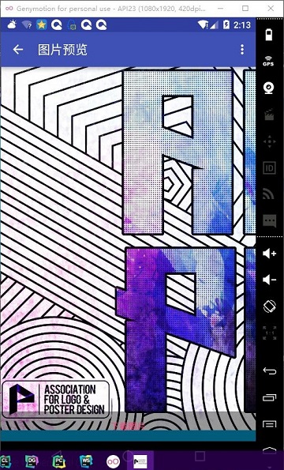
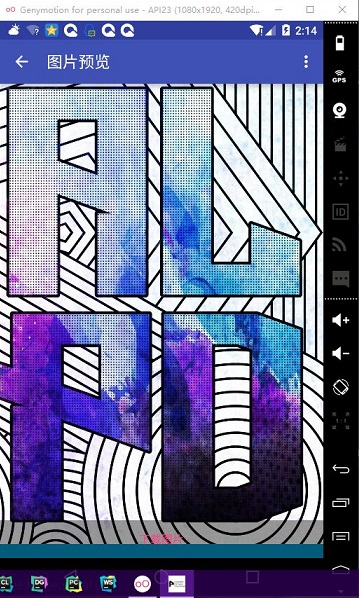
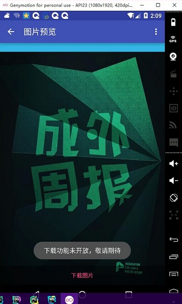
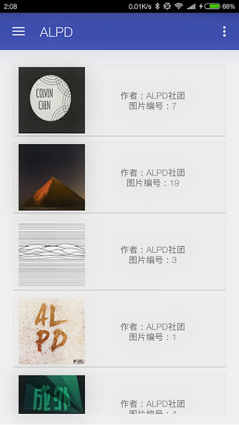

# ALPD-app

ALPD组织的安卓app,原计划是用Kotlin写，后来发现AS装上Kotlin插件后并不能正常运行。。。  :joy: 
所以是Java~ 
全栈项目，由冰封个人开发！ 

## 关于ALPD
这是一个做海报的社团。 
其实社团还有另两个程序员，不过 
一个现在还在学H5(我正在劝说他学ROR) :joy: 
一个在学iOS(无法阻止) :joy: 

## 发展计划
- [X] 更快的后端云
- [X] 自动加载预览小图片
- [X] 点击加载大图片
- [ ] 下拉刷新
- [ ] 下载大图片
- [ ] 账号系统
- [ ] 更优美的UI(社长你给我过来 :angry: )

## 关于APP后台
冰封由于没有得到社团的任何资金支持~ 
所以这个的后台是用的coding(早期是github)~ 
ALPD的海报托管在[这里](https://coding.net/u/ice1000/p/App-raw/git)。 
现在的运维是何天昊。 
这是对资源的一种灵活运用 不是吗？ :joy:

## 更新记录

### 2016年4月11日 凌晨
1. 实现预览大图功能
1. 更浅色的预览栏
1. 预览栏显示图片编号

### 2016年4月10日
1. 更新[后端云——coding](https://coding.net/u/ice1000/p/App-raw/git)，快得多~ 爽死了~

### 2016年4月8日之前
1. 完善基本功能：Main AboutMe Base Launch Settings
1. 简单布局
1. 网络流 下载图片from github(github太慢啦~也有可能先换个国内git托管仓库或者用一些第三方后端云)
